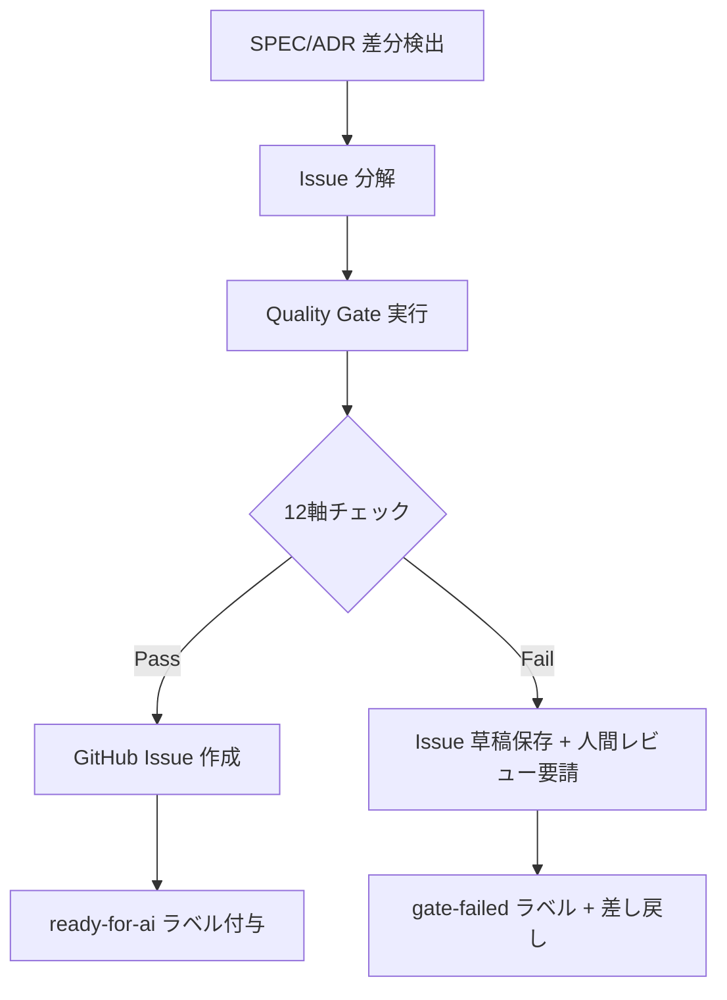
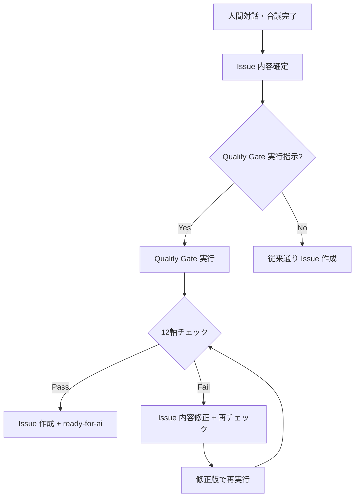
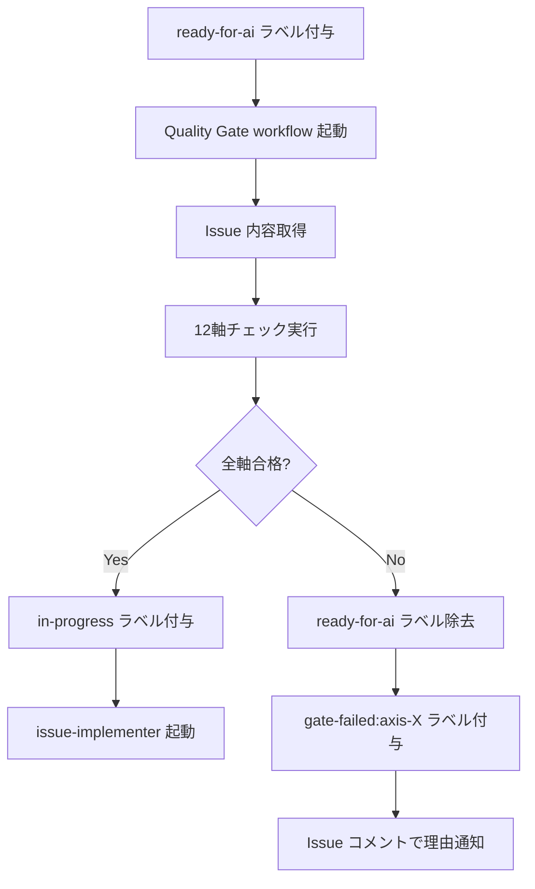

# 発動契機詳細プロトコル

本ドキュメントは crosscut-issue-quality-gate の 3 つの発動契機（a/b/d）の詳細な発動条件・処理フロー・連携方法を定義する。

## 発動契機 (a): crosscut-issue-dispatcher 内部通過

### 概要

SPEC/ADR 差分起点で Issue が生成される際、`crosscut-issue-dispatcher` の処理フロー内で **必ず** 本 skill を通過する設計。

### 発動条件

1. `crosscut-issue-dispatcher` が SPEC.md / ADR の差分を検出
2. Issue 分解処理が完了
3. GitHub Issue 作成直前のタイミング

### 処理フロー



### 統合方法

`crosscut-issue-dispatcher/references/dispatch-protocol.md` を以下のように拡張：

```bash
# Issue 作成前に Quality Gate を実行
quality_gate_result=$(crosscut-issue-quality-gate --source="dispatcher" --issue-draft="$issue_content")

if [ "$quality_gate_result" = "pass" ]; then
  gh issue create --title "$title" --body "$body" --label "ready-for-ai"
else
  # 草稿として保存し、人間レビューを要請
  echo "$issue_content" > .github/issue-drafts/$(date +%s).md
  notify_human_review "$quality_gate_result"
fi
```

### エラー処理

| エラー種別 | 対処法 |
|---|---|
| Quality Gate が応答しない | タイムアウト後、警告ラベル付きで Issue 作成 |
| 部分的失敗 | 失敗した軸の詳細をコメントで追記 |
| 設定不備 | デフォルト設定で継続、設定不備を通知 |

## 発動契機 (b): L0/Council/D4〜D2 献上時明示呼び出し

### 概要

人間対話・合議起点の Issue 作成時に **明示的に** 本 skill を呼び出す設計。自動化ではなく、人間の判断で発動。

### 発動条件

#### L0 spec-architect 対話時

1. L0 セッションで Issue 生成指示が出た
2. 対話終了前の確認フェーズ
3. 明示的な Quality Gate 実行指示

#### Council 献上時

1. Council で Issue 化が決定された
2. 献上者が Issue を作成する前
3. Council の recommendation に Quality Gate 通過が含まれる

#### D4〜D2 献上時

1. 下位レイヤーから上位レイヤーへの Issue 献上
2. 献上フォーマットの確認後
3. 公式 Issue 化の直前

### 処理フロー



### 統合方法

#### L0 spec-architect 統合

`layer0-spec-architect/SKILL.md` に以下セクションを追加：

```markdown
## Issue Quality Gate 連携

L0 セッションで Issue 生成を行う場合、以下の手順で Quality Gate を通過させる：

1. Issue 内容を確定
2. `crosscut-issue-quality-gate --source="l0" --draft="$issue_content"` を実行
3. 結果に基づき Issue 内容を調整
4. 合格後に正式な Issue を作成
```

#### Council 統合

`crosscut-council/SKILL.md` に以下を追記：

```markdown
## Issue Quality Gate との連携

Council で Issue 化を recommendation する場合：

- recommendation に「Quality Gate 通過後」の条件を明記
- 献上者は Issue 作成前に Quality Gate 実行を必須とする
- Gate 失敗時は Council 再諮問または内容修正を選択
```

### 人間判断のガイドライン

| 判定結果 | 推奨アクション |
|---|---|
| 全軸 Pass | そのまま Issue 作成 |
| 軽微な Fail（1-2軸） | 内容修正後再チェック |
| 重大な Fail（3軸以上） | 設計根本見直し |
| Security/Safety 系 Fail | 必ず修正、妥協なし |

## 発動契機 (d): GitHub Actions による最終ガード

### 概要

Issue に `ready-for-ai` ラベルが付与された時点で、`crosscut-issue-implementer` 起動直前の **最終ガード** として実行。

### 発動条件

1. 既存 Issue に `ready-for-ai` ラベルが付与された
2. `crosscut-issue-implementer` の起動条件を満たしている
3. GitHub Actions workflow がトリガーされた

### 処理フロー



### Workflow 設定

`templates/github-workflows/issue-quality-gate.yml.template`:

```yaml
name: Issue Quality Gate
on:
  issues:
    types: [labeled]

jobs:
  quality-gate:
    if: github.event.label.name == 'ready-for-ai'
    runs-on: ubuntu-latest
    
    steps:
    - name: Checkout
      uses: actions/checkout@v4
      
    - name: Run Quality Gate
      id: quality-gate
      run: |
        # Issue 内容を取得
        issue_body=$(gh issue view ${{ github.event.issue.number }} --json body | jq -r '.body')
        
        # Quality Gate 実行
        result=$(crosscut-issue-quality-gate \
          --source="github-actions" \
          --issue-number="${{ github.event.issue.number }}" \
          --issue-body="$issue_body")
        
        echo "result=$result" >> $GITHUB_OUTPUT
      env:
        GH_TOKEN: ${{ secrets.GITHUB_TOKEN }}
        
    - name: Handle Pass
      if: steps.quality-gate.outputs.result == 'pass'
      run: |
        gh issue edit ${{ github.event.issue.number }} --add-label "in-progress"
        echo "Quality Gate passed. Issue is ready for implementation."
      env:
        GH_TOKEN: ${{ secrets.GITHUB_TOKEN }}
        
    - name: Handle Fail
      if: steps.quality-gate.outputs.result != 'pass'
      run: |
        # ready-for-ai ラベルを除去
        gh issue edit ${{ github.event.issue.number }} --remove-label "ready-for-ai"
        
        # 失敗理由ラベルを付与
        failed_axes=$(echo "${{ steps.quality-gate.outputs.result }}" | jq -r '.failed_axes[]')
        for axis in $failed_axes; do
          gh issue edit ${{ github.event.issue.number }} --add-label "gate-failed:axis-$axis"
        done
        
        # コメントで理由を通知
        gh issue comment ${{ github.event.issue.number }} --body "$(cat <<EOF
        ## Quality Gate Failed
        
        この Issue は品質ガードで以下の軸で不合格となりました：
        
        ${{ steps.quality-gate.outputs.result }}
        
        修正後、\`ready-for-ai\` ラベルを再度付与してください。
        EOF
        )"
      env:
        GH_TOKEN: ${{ secrets.GITHUB_TOKEN }}
```

### 既存 workflow との統合

`templates/github-workflows/issue-pickup.yml.template` の modification:

```yaml
# 既存の issue-pickup workflow に依存条件を追加
jobs:
  pickup:
    # Quality Gate 通過後のみ起動
    if: |
      contains(github.event.issue.labels.*.name, 'ready-for-ai') &&
      contains(github.event.issue.labels.*.name, 'in-progress')
```

## 3 発動契機の相互関係

### 優先順位

1. **(a) dispatcher 内部**: 最優先、必ず実行
2. **(d) GitHub Actions**: セカンダリガード、(a) をすり抜けた場合の保険
3. **(b) 明示呼び出し**: 人間判断、(a)/(d) を補完

### 重複実行の回避

- Issue に `quality-gate:passed` ラベルを付与し、重複チェックを回避
- 各発動契機で異なる source タグを記録
- 直近 24時間以内の同一 Issue への重複実行は skip

### ログ・監査

全ての発動契機で以下を記録：

```json
{
  "timestamp": "2026-05-04T05:45:00Z",
  "source": "dispatcher|l0|council|github-actions",
  "issue_number": 46,
  "result": "pass|fail|warn",
  "axes_results": {
    "A": {"judgment": "pass", "confidence": 0.85},
    "B": {"judgment": "fail", "confidence": 0.92}
  },
  "execution_time_ms": 1250
}
```

## 緊急時のバイパス

### フェイルセーフ機構

Quality Gate が応答しない場合の処理：

1. **タイムアウト**: 30秒でタイムアウト、警告付きで通過
2. **エラー**: 3回再試行後、人間判断に委譲
3. **設定不備**: デフォルト設定で継続実行

### 緊急バイパス

セキュリティパッチ等の緊急時：

1. `emergency-bypass` ラベルで Quality Gate をスキップ
2. バイパス理由を Issue コメントで明記
3. 事後 Quality Gate 実行で監査

### 管理者オーバーライド

管理者権限で Quality Gate 結果をオーバーライド：

```bash
# 管理者による強制通過
gh issue edit 46 --add-label "gate-override:admin" --remove-label "gate-failed:axis-A"
gh issue comment 46 --body "Admin override: Quality Gate bypassed for [理由]"
```

## 設定のカスタマイズ

各プロジェクトは `.github/quality-gate-config.yml` で発動契機をカスタマイズ可能：

```yaml
activation:
  dispatcher_integration: true
  l0_integration: true  
  council_integration: true
  github_actions_integration: true
  
  # 緊急時設定
  emergency_bypass_enabled: true
  admin_override_enabled: true
  failsafe_timeout_seconds: 30
  
  # ログ設定  
  audit_logging: true
  log_retention_days: 90
```