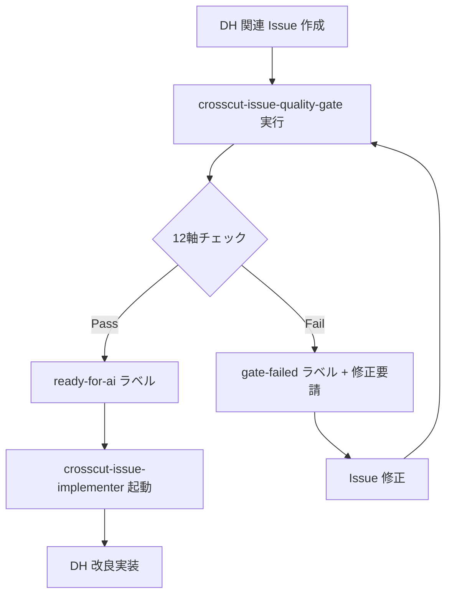

# DH メタ自己適用（フラクタル原則）

本ドキュメントは crosscut-issue-quality-gate が DH（dialog-harness）自身に対してどのように適用されるかを定義する。フラクタル原則に基づく自己相似性の実装。

## フラクタル原則の意味

### 基本概念

**フラクタル原則**: DH が開発する「他のプロジェクトへの規律」は、DH 自身にも等しく適用される。

```
DH が生成する規律 = DH 自身が従う規律
```

この自己相似性により、DH の内部構造と外部への提供価値が整合し、**「靴屋の靴問題」**（優れたツールを作る組織が自身のツール管理は雑、という矛盾）を回避する。

### philosophy.md での位置づけ

philosophy.md 第 1 条「フラクタル原則」での明文化：
- P1: 層構造の自己相似性（L0/L1/L2 が再帰的に適用される）
- **P1 拡張**: 規律の自己相似性（Quality Gate 等の規律が DH 自身にも適用される）

## DH メタ Issue への適用

### 対象となる Issue

1. **dh-upgrades Issue**: `dh-upgrades/upgrade-spec-*.md` から派生する Issue
2. **skill 開発 Issue**: 新 skill 追加・既存 skill 改修
3. **philosophy 改訂 Issue**: philosophy.md の条項追加・修正
4. **harness-verifier 改修**: D4 検査機構の改善
5. **その他 DH 自身の改良**: README・template・workflow 改修

### 例外なし原則

**すべて** の DH 関連 Issue は crosscut-issue-quality-gate を通過する。以下の例外は **認めない**：

❌ **「緊急パッチだから skip」**  
❌ **「内部 Issue だから軽微」**  
❌ **「開発者が同一人物だから不要」**  
❌ **「DH の設計者判断で bypass」**  

✅ **唯一の例外**: Quality Gate 自身の初回実装（循環問題回避）

## 本 Issue #46 の特別な意味

### Quality Gate 完成前の最初の事例

本 Issue #46（crosscut-issue-quality-gate 新設）は **Quality Gate 完成前に作成された最後の Issue** として歴史的意味を持つ。

完成後は、本 Issue を遡及的に Quality Gate で評価し、以下を確認する：
1. Quality Gate の判定精度
2. Issue 作成プロセスの改善点
3. 12 軸基準の妥当性

### 自己採点の意味

完成後の自己適用テストとして、本 Issue を 12 軸チェックリストで採点する `delivery/self-gate-check-AD010.md` を出力する。

これは **Quality Gate が自分自身を評価する** メタ構造であり、以下の価値がある：
- Quality Gate の有効性実証
- 規格の改良フィードバック
- フラクタル原則の実装確認

### 既知の減点項目

本 Issue 初版時点で以下の軸違反が **既知**：

**軸 A（仕様整合）**:
- 初版が `crosscut-issue-implementer/references/setup-checklist.md` の必須セクション規定に違反
- 「再現手順」「期待動作」「受入条件」セクションが不在だった

**軸 viii（テスト粒度）**:
- test-first 計画が初版で明示されていなかった
- Issue 段階でのテスト戦略が不明確だった

これらは Quality Gate 完成後の規格改良へのフィードバック材料として記録する。

## DH メタ Issue の 12 軸適用

### 軸 A: 仕様整合（DH メタ版）

**機械検査**:
- DH 自身の SPEC.md（存在する場合）との照合
- philosophy.md との矛盾検出
- 既存 skill の設計原則との整合

**AI 推論**:
- フラクタル原則への準拠確認
- 5 層構造（D1〜D5）との整合性
- philosophy.md 6+1 条との矛盾回避

**合格基準**:
- philosophy.md の 6+1 条と矛盾しない
- 既存 skill の設計原則と整合
- フラクタル原則を損なわない

### 軸 vi: 観測性統一（DH メタ版）

**特別な意味**: DH 自身の観測性が Council の自己観測に直結

**機械検査**:
- DH skill 起動ログの構造化確認
- Issue ライフサイクル追跡の schema 統一
- Council 議事録の構造化

**AI 推論**:
- Council 自身が DH の状態を観測可能か
- DH メタ層の観測性が二層モデルに準拠しているか
- DH の健全性を一目で判断可能か

**合格基準**:
- DH 自身の観測データが構造化されている
- Council が DH の状態を適切に観測できる
- DH メタダッシュボードで健全性が一目でわかる

### 軸 ix: 並列安全性（DH メタ版）

**特別な考慮**: DH 開発は少数開発者だが、skill 間の依存が複雑

**機械検査**:
- DH skill 間の依存関係確認
- harness-verifier の独立性保持
- Council への影響範囲評価

**AI 推論**:
- 新 skill が既存 skill に与える影響
- philosophy.md 改訂が全体に与える波及
- D4/D5 境界の維持

**合格基準**:
- 既存 skill の責務を侵害しない
- harness-verifier の独立性を損なわない
- philosophy.md の一貫性を保つ

## メタ循環の回避

### 自己言及のパラドックス対策

Quality Gate が自分自身を評価する際の論理的課題：

**問題**: 「Quality Gate が壊れていたら、自分自身の壊れを検出できない」

**解決策**:
1. **harness-verifier による外部検証**: D4 検査機構（独立）で Quality Gate の構造整合性を確認
2. **段階的適用**: Quality Gate 完成後の遡及適用で初期状態を検証
3. **Council による外部監査**: Council が Quality Gate の有効性を合議判定

### Russell のパラドックス回避

「すべての Issue を検査する検査機構を、誰が検査するか」問題：

```
Level N: Issue（一般）
Level N+1: Quality Gate（Issue を検査）
Level N+2: harness-verifier（Quality Gate を検査）
Level N+3: 人間 ≒ Council（harness-verifier を監査）
```

階層分離により循環を回避。

## 自己適用プロトコル

### 遡及的自己評価手順

1. **Quality Gate 完成**（本 Issue #46 の merge 完了）
2. **self-gate-check 実行**: 本 Issue を 12 軸で評価
3. **結果記録**: `delivery/self-gate-check-AD010.md` に評価結果を出力
4. **改良フィードバック**: 失敗した軸の改善案を記録
5. **規格更新**: 必要に応じて 12 軸規格の調整

### self-gate-check の出力形式

```markdown
# Self Gate Check: Issue #46 (AD-010)

## 実行概要
- 実行日時: 2026-05-04T06:00:00Z
- 対象 Issue: #46 crosscut-issue-quality-gate 新設
- Quality Gate version: v5.8.0

## 12 軸評価結果

### 軸 A: 仕様整合
- 判定: **FAIL** 
- 理由: 初版が必須セクション（再現手順/期待動作/受入条件）を欠いていた
- 証拠: setup-checklist.md の必須項目規定に違反
- 改善案: Issue テンプレートの自動検証強化

### 軸 viii: テスト粒度  
- 判定: **FAIL**
- 理由: test-first 計画が初版で明示されていなかった
- 証拠: テスト戦略の記述が Issue 後半で追加された
- 改善案: Issue 作成時の test-first チェックリスト必須化

### 軸 ii: 重複検出
- 判定: **PASS**
- 理由: 類似機能の existing skill が存在しない
- 証拠: crosscut-* 系で quality gate は初実装

...

## 総合判定
- **合格軸**: 10/12
- **不合格軸**: 2/12（軸 A, viii）
- **Quality Gate 完成前**: 理解可能な範囲での違反
- **総評**: Quality Gate の有効性を実証、改良点も明確

## 改良フィードバック
1. Issue テンプレートの強化（軸 A 対応）
2. test-first チェックリストの追加（軸 viii 対応）  
3. 段階的 Issue 作成の検討（大型 Issue の分割）
```

### 継続的自己適用

Quality Gate 完成後は、**すべて** の DH 関連 Issue が自動的に Quality Gate を通過する：



## 外部プロジェクトとの対称性

### 同等の厳格性

DH 自身への Quality Gate 適用は、外部プロジェクトへの適用と **同等の厳格性** で行う：

- 緩和規定なし（DH だから甘くするということはない）
- 同じ 12 軸、同じ合格基準
- 同じ不合格時の修正要請

### 信頼性の実証

DH が自身に Quality Gate を適用することで、外部プロジェクトへの説得力が向上：

**Before**: 「DH が作った Quality Gate を使ってください」  
**After**: 「DH 自身が日常的に使っている Quality Gate です。実証済みです。」

### フィードバックループ

DH 自身での使用により、Quality Gate の改良が accelerate：

```
DH 使用 → 課題発見 → Quality Gate 改良 → 外部プロジェクトに恩恵
```

## 将来拡張

### メタメタ層への適用

将来的に DH がより複雑になった場合：

- **Layer N+3**: DH ecosystem 全体（複数 DH instance）
- **Layer N+4**: DH 開発方法論そのものの品質管理

### 自動化の拡張

現在は遡及的評価だが、将来的には：

- DH Issue 作成時の自動 Quality Gate 適用
- DH skill 開発 workflow への完全統合
- DH メタ observability の自動監視

## 哲学的意義

### 自己言及の美学

Quality Gate が自分自身を評価する構造は、以下の哲学的意味を持つ：

1. **自己改善の駆動力**: 自分が作った基準で自分を評価する緊張感
2. **規律の内在化**: 外部に強制する規律を自分も守る誠実性
3. **フラクタル美**: 構造の自己相似性による設計の一貫性

### レベル混在の調和

通常、自己言及は論理的問題を起こすが、本実装では：

- 階層分離（Quality Gate ≠ harness-verifier）で循環回避
- 段階的適用で初期状態の問題を解決
- Council による外部監査で客観性を保持

これにより、**自己言及の利点**（自己改善・規律の内在化）を保ちつつ、**論理的問題**（循環・パラドックス）を回避する。