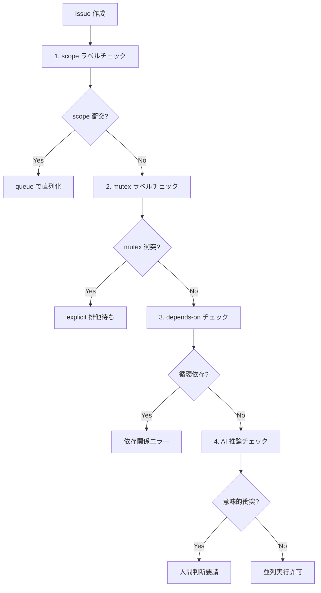

# 並列安全性機構（軸 ix）

本ドキュメントは crosscut-issue-quality-gate の軸 ix（並列安全性）について、4 段階フィルター・Big Refactor 特例・workflow 組み込み手順の詳細を定義する。

## 基本概念

### 並列実行時の 4 種類のコンフリクト

Issue 並列実行時のコンフリクトは git で検出可能な **物理コンフリクト** の他に、以下 3 種が存在する：

| コンフリクト種類 | 説明 | git による検出 | 例 |
|---|---|---|---|
| **物理** | 同一ファイル・同一行の編集 | ✅ 可能 | merge conflict |
| **論理** | 同一抽象・同一機能への影響 | ❌ 不可能 | 同じ API の異なる実装 |
| **意味** | ビジネスルール・設計意図の衝突 | ❌ 不可能 | 相反する UI/UX 改善 |
| **依存** | 順序・前提条件の違反 | ❌ 不可能 | データ移行前に新機能実装 |

軸 ix は git では検出不能な 3 種（論理・意味・依存）を **事前検知** する。

## 4 段階フィルター



### Stage 1: scope ラベル（機械的）

**目的**: 基本ガード、workflow concurrency 分割

**仕組み**:
- Issue に `scope:*` ラベルを付与（例: `scope:db`, `scope:frontend`, `scope:auth`）
- 同 scope の Issue は **queue で直列**、別 scope は **並列** 実行
- GitHub Actions の `concurrency` group で制御

**実装**:
```yaml
# .github/workflows/issue-pickup.yml での実装
concurrency:
  group: "issue-pickup-scope-${{ needs.get_scope.outputs.scope_label }}"
  cancel-in-progress: false  # queue 化、cancel はしない
```

**scope ラベル例**:
| ラベル | 対象範囲 | 例 |
|---|---|---|
| `scope:db` | データベース schema・migration | DB テーブル追加、インデックス変更 |
| `scope:frontend` | FE コンポーネント・UI | React コンポーネント、CSS 変更 |
| `scope:auth` | 認証・認可 | ログイン機能、権限管理 |
| `scope:api` | API 仕様・エンドポイント | REST API 追加、GraphQL schema |
| `scope:docs` | ドキュメント | README、API docs |
| `scope:infra` | インフラ・デプロイ | Docker、CI/CD、環境設定 |

**フォールバック**:
scope ラベル未設定時は `scope:general` として扱い、**慎重に直列化**。

### Stage 2: mutex ラベル（機械的）

**目的**: 明示排他、共有抽象を保護

**仕組み**:
- `mutex:*` ラベルで共有抽象の排他制御
- 同 mutex の Issue が in-progress 時は、新 Issue は待機
- 抽象レベルの競合を明示的に宣言

**mutex ラベル例**:
| ラベル | 排他対象 | 例 |
|---|---|---|
| `mutex:auth-model` | 認証データモデル | User テーブル、権限 enum |
| `mutex:state-machine` | アプリケーション状態 | 注文ステータス、ワークフロー |
| `mutex:payment-flow` | 決済フロー | 決済 API、請求処理 |
| `mutex:notification-system` | 通知システム | メール送信、push 通知 |

**実装**:
```bash
# 機械チェック例
check_mutex_conflict() {
    local issue_mutex_labels=$(echo "$issue_labels" | grep "^mutex:")
    
    for mutex_label in $issue_mutex_labels; do
        # 同 mutex で in-progress の Issue をチェック
        existing_issues=$(gh issue list \
            --label "$mutex_label" \
            --label "in-progress" \
            --json number,title)
            
        if [ "$(echo "$existing_issues" | jq length)" -gt 0 ]; then
            echo "MUTEX_CONFLICT: $mutex_label"
            echo "Existing in-progress issues: $existing_issues"
            return 1
        fi
    done
    return 0
}
```

### Stage 3: depends-on 宣言（機械的）

**目的**: 論理依存を表現、順序保証

**仕組み**:
- Issue body に `depends-on: #123` 形式で依存宣言
- 依存先 Issue が完了するまで、依存元 Issue は待機
- 循環依存の検出・回避

**記述形式**:
```markdown
## 依存関係

depends-on: #42
depends-on: #43

この Issue は #42（ユーザー認証機能）と #43（データベース migration）の完了後に開始します。
```

**実装**:
```bash
# 依存関係チェック例
check_depends_on() {
    local depends_on_issues=$(grep -E "depends[- ]on:?\s*#[0-9]+" <<< "$issue_body" | \
        sed -E 's/.*#([0-9]+).*/\1/g')
    
    for dep_issue in $depends_on_issues; do
        # 依存先 Issue の状態確認
        dep_status=$(gh issue view "$dep_issue" --json state | jq -r '.state')
        
        if [ "$dep_status" != "closed" ]; then
            echo "DEPENDENCY_NOT_READY: #$dep_issue is $dep_status"
            return 1
        fi
    done
    
    # 循環依存チェック（簡易実装）
    detect_circular_dependency "$issue_number" "$depends_on_issues"
}
```

**循環依存検出**:
```bash
detect_circular_dependency() {
    local current_issue="$1"
    local visited_issues=("$current_issue")
    
    # DFS で循環検出（実装例）
    local stack=($2)  # depends_on_issues
    
    while [ ${#stack[@]} -gt 0 ]; do
        local issue=${stack[0]}
        stack=("${stack[@]:1}")  # pop
        
        if [[ " ${visited_issues[@]} " =~ " ${issue} " ]]; then
            echo "CIRCULAR_DEPENDENCY detected: $current_issue -> ... -> $issue -> $current_issue"
            return 1
        fi
        
        # issue の依存先を追加
        local issue_deps=$(gh issue view "$issue" --json body | \
            jq -r '.body' | grep -E "depends[- ]on:?\s*#[0-9]+" | \
            sed -E 's/.*#([0-9]+).*/\1/g')
            
        stack+=($issue_deps)
        visited_issues+=("$issue")
    done
    return 0
}
```

### Stage 4: AI 推論（意味的）

**目的**: Stage 1-3 の見落としを意味的に検知

**仕組み**:
- in-progress Issue list を取得
- 新 Issue との意味的衝突を AI で判定
- Stage 1-3 では捕まらない抽象的な衝突を検出

**AI 判定プロンプト例**:
```
以下の in-progress Issues と新 Issue を比較し、並列実行時の衝突リスクを評価してください：

【in-progress Issues】
#45: ユーザープロファイル画面のリニューアル (scope:frontend)
#47: 決済フローの UX 改善 (scope:frontend, mutex:payment-flow)

【新 Issue】  
#48: ショッピングカート UI の改善 (scope:frontend)

【判定観点】
1. 業務フローの競合（ユーザー操作の流れに影響するか）
2. 設計思想の衝突（相反する UX 方針がないか）  
3. 共有リソースの競合（同じコンポーネント・API への影響）
4. ユーザー体験の一貫性（UI/UX の整合性）

【回答形式】
{
  "conflict_risk": "low|medium|high",
  "reasoning": "判定理由",
  "recommendations": ["推奨アクション"]
}
```

**AI 判定例**:
```json
{
  "conflict_risk": "medium",
  "reasoning": "ショッピングカート UI とユーザープロファイル画面は画面遷移で連携するため、UX の一貫性に影響する可能性。決済フローとは直接競合しないが、全体的なデザインシステムへの影響を考慮すべき。",
  "recommendations": [
    "デザインシステム担当者とのレビュー",
    "プロトタイプでの動線確認", 
    "#45 完了後の開始を推奨"
  ]
}
```

## Big Refactor 特例

### 大型改修の問題

通常の並列ガード（scope/mutex/depends-on）では捕まえにくい大型改修・方針転換がある：

- アーキテクチャ全体の見直し
- デザインシステムの刷新
- 技術スタック移行
- データモデル根本変更

これらは **多数の Issue と衝突** するが、個別の scope/mutex では表現困難。

### 解決策: refactor ラベル + freeze 制御

| ラベル | 効果 | 適用例 |
|---|---|---|
| `refactor:major` | **全 Issue に `do-not-pickup` 自動付与** → 全面凍結 | アーキテクチャ刷新、技術スタック移行 |
| `refactor:minor` | **同 scope の他 Issue のみ pause** → 部分凍結 | 単一モジュールのリファクタ |
| `freeze-period` | **全 Issue を pause**（管理用） | リリース直前の凍結期間 |

### `refactor:major` 実装

```bash
# refactor:major 検出時の処理
handle_major_refactor() {
    local refactor_issue="$1"
    
    echo "Major refactor detected: Issue #$refactor_issue"
    
    # 全ての open Issue に do-not-pickup ラベル追加
    gh issue list --state open --json number | jq -r '.[].number' | while read issue_num; do
        if [ "$issue_num" != "$refactor_issue" ]; then
            gh issue edit "$issue_num" --add-label "do-not-pickup"
            gh issue comment "$issue_num" --body "$(cat <<EOF
🚧 **Development Freeze** 

Issue #$refactor_issue (Major Refactor) により開発凍結中です。
refactor 完了後に \`do-not-pickup\` ラベルを除去します。

Refactor Issue: #$refactor_issue
EOF
            )"
        fi
    done
    
    echo "Development freeze applied to all open issues"
}

# refactor 完了時の解除
release_major_refactor() {
    local refactor_issue="$1"
    
    echo "Major refactor completed: Issue #$refactor_issue"
    
    # 全 Issue の do-not-pickup ラベル除去
    gh issue list --label "do-not-pickup" --json number | jq -r '.[].number' | while read issue_num; do
        gh issue edit "$issue_num" --remove-label "do-not-pickup"
        gh issue comment "$issue_num" --body "$(cat <<EOF
✅ **Development Freeze Released**

Major refactor (#$refactor_issue) が完了しました。
通常の開発を再開できます。
EOF
        )"
    done
}
```

### `freeze-period` 管理用

```bash
# リリース前の一時凍結
apply_freeze_period() {
    local reason="$1"  # e.g., "v5.8.0 release preparation"
    
    gh issue list --state open --json number | jq -r '.[].number' | while read issue_num; do
        gh issue edit "$issue_num" --add-label "freeze-period"
    done
    
    echo "Freeze period applied: $reason"
}

# 凍結解除
release_freeze_period() {
    gh issue list --label "freeze-period" --json number | jq -r '.[].number' | while read issue_num; do
        gh issue edit "$issue_num" --remove-label "freeze-period"
    done
    
    echo "Freeze period released"
}
```

## workflow 組み込み

> **v5.8.0 制約注記**: 下記の「改修後」形は **GitHub Actions の workflow-level `concurrency` block が `steps.*` を参照できない**制約により完全実装不可。v5.8.0 では Issue 番号ベース（v5.7.x 互換）を維持し、scope 動的判定は v5.8.x patch で jobs 内自前実装 or 静的 contains chain として本実装する。詳細: `dh-upgrades/upgrade-spec-v5.8.0.md`「concurrency 制約注記」

### issue-pickup.yml の改修

**現行（v5.7.x / v5.8.0 維持）**:
```yaml
concurrency:
  group: "issue-pickup-${{ github.event.issue.number }}"
```

**改修案（v5.8.x 候補、未実装）**:
```yaml
jobs:
  get-scope:
    runs-on: ubuntu-latest
    outputs:
      scope_label: ${{ steps.scope.outputs.label }}
    steps:
    - name: Extract scope label
      id: scope
      run: |
        # Issue ラベルから scope:* を抽出
        scope_label=$(gh issue view ${{ github.event.issue.number }} --json labels | \
          jq -r '.labels[] | select(.name | startswith("scope:")) | .name' | \
          head -1)
        
        # scope ラベル未設定時は general
        if [ -z "$scope_label" ]; then
          scope_label="scope:general"
          gh issue edit ${{ github.event.issue.number }} --add-label "$scope_label"
        fi
        
        echo "label=${scope_label}" >> $GITHUB_OUTPUT
      env:
        GH_TOKEN: ${{ secrets.GITHUB_TOKEN }}

  pickup:
    needs: get-scope
    runs-on: ubuntu-latest
    
    # scope ベースの concurrency
    concurrency:
      group: "issue-pickup-${{ needs.get-scope.outputs.scope_label }}"
      cancel-in-progress: false
    
    steps:
    - name: Parallel Safety Check
      run: |
        # 4 段階フィルター実行
        result=$(crosscut-issue-quality-gate \
          --axis="ix" \
          --issue-number="${{ github.event.issue.number }}")
        
        if [ "$result" != "pass" ]; then
          echo "Parallel safety check failed: $result"
          exit 1
        fi
      env:
        GH_TOKEN: ${{ secrets.GITHUB_TOKEN }}
    
    # 従来の処理続行...
```

### scope ラベル自動付与

```yaml
# scope ラベル未設定 Issue への自動付与
- name: Auto-assign scope label
  run: |
    # ファイル変更パターンから scope を推定
    changed_files=$(gh pr view ${{ github.event.pull_request.number }} --json files | \
      jq -r '.files[].path')
    
    scope="general"
    if echo "$changed_files" | grep -q "src/components\|src/pages"; then
      scope="frontend"
    elif echo "$changed_files" | grep -q "src/api\|src/services"; then
      scope="api"  
    elif echo "$changed_files" | grep -q "migrations\|schema"; then
      scope="db"
    elif echo "$changed_files" | grep -q "docs\|README"; then
      scope="docs"
    fi
    
    gh issue edit ${{ github.event.issue.number }} --add-label "scope:$scope"
```

## ラベル規約配布

各プロジェクトで以下のラベルを作成（`assets/` 配下でテンプレート配布）：

### scope ラベル

```yaml
# .github/labels/scope-labels.yml
- name: "scope:db"
  color: "d73a4a"
  description: "Database schema, migrations, data layer"
  
- name: "scope:frontend" 
  color: "0075ca"
  description: "UI components, client-side code"
  
- name: "scope:api"
  color: "cfd3d7" 
  description: "REST API, GraphQL, server endpoints"
  
- name: "scope:auth"
  color: "a2eeef"
  description: "Authentication, authorization, security"
  
- name: "scope:docs"
  color: "7057ff"
  description: "Documentation, README, guides"
  
- name: "scope:infra"
  color: "008672"
  description: "Infrastructure, deployment, CI/CD"
  
- name: "scope:general"
  color: "e4e669"
  description: "General changes not fitting other scopes"
```

### mutex ラベル

```yaml
- name: "mutex:auth-model"
  color: "d93f0b"
  description: "User authentication data model"
  
- name: "mutex:state-machine" 
  color: "d93f0b"
  description: "Application state transitions"
  
- name: "mutex:payment-flow"
  color: "d93f0b" 
  description: "Payment processing workflow"
```

### refactor ラベル

```yaml
- name: "refactor:major"
  color: "b60205"
  description: "Major refactoring - freezes all development"
  
- name: "refactor:minor"
  color: "d93f0b"
  description: "Minor refactoring - freezes same scope only"
  
- name: "freeze-period"
  color: "000000"
  description: "Administrative development freeze"
```

## プロジェクト固有カスタマイズ

```yaml
# .github/parallel-safety-config.yml
parallel_safety:
  scope_labels:
    # プロジェクト固有 scope 追加
    - "scope:mobile"
    - "scope:analytics" 
    
  mutex_labels:
    # プロジェクト固有 mutex 追加
    - "mutex:recommendation-engine"
    - "mutex:search-algorithm"
    
  ai_judgment:
    confidence_threshold: 0.8
    conflict_risk_threshold: "medium"
    
  big_refactor:
    major_auto_freeze: true
    minor_scope_freeze: true
    freeze_notification: true
```

## 監視・メトリクス

並列安全性機構の効果を測定：

```yaml
# 並列安全性メトリクス
metrics:
  conflict_prevention:
    - scope_conflicts_prevented_count
    - mutex_conflicts_prevented_count  
    - ai_detected_conflicts_count
    
  efficiency:
    - parallel_execution_ratio
    - queue_wait_time_avg
    - refactor_freeze_duration
    
  quality:
    - false_positive_rate
    - manual_override_rate
    - post_merge_conflicts_count
```

これらメトリクスにより、並列安全性機構の効果を定量評価し、継続改善を行う。