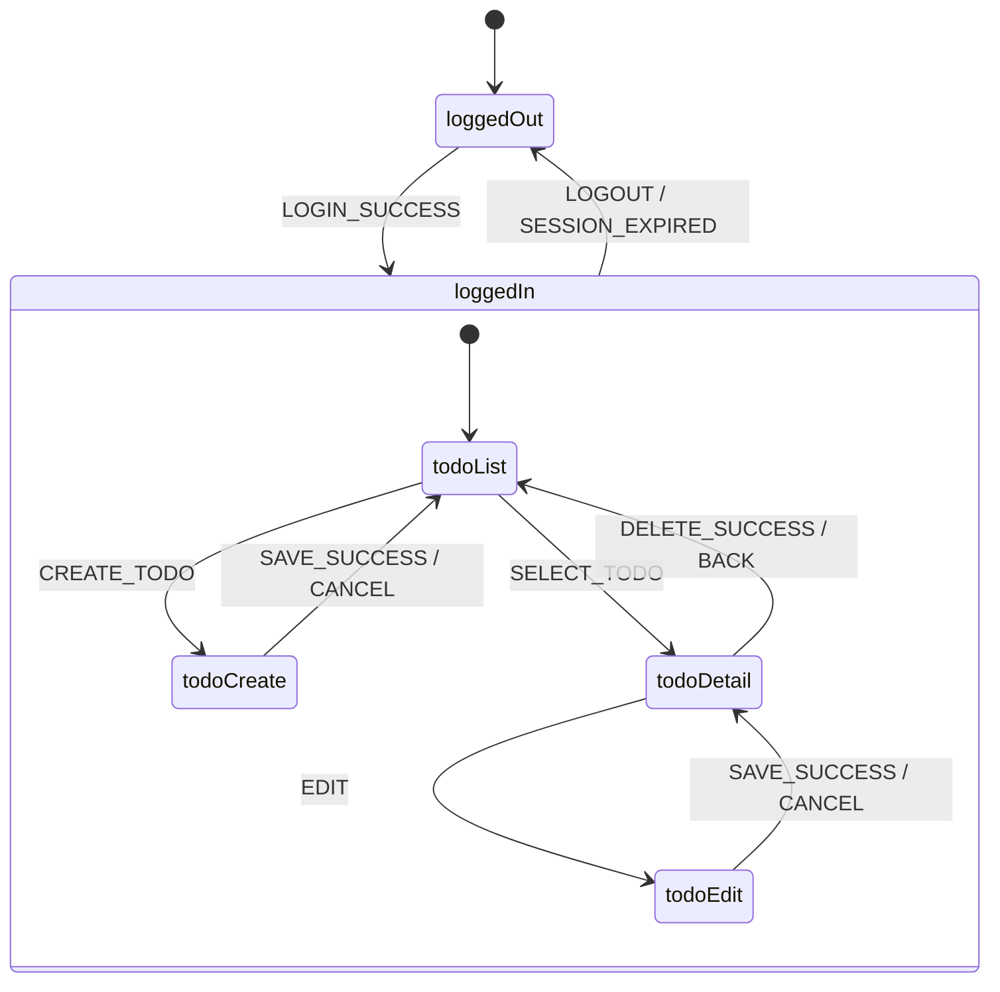
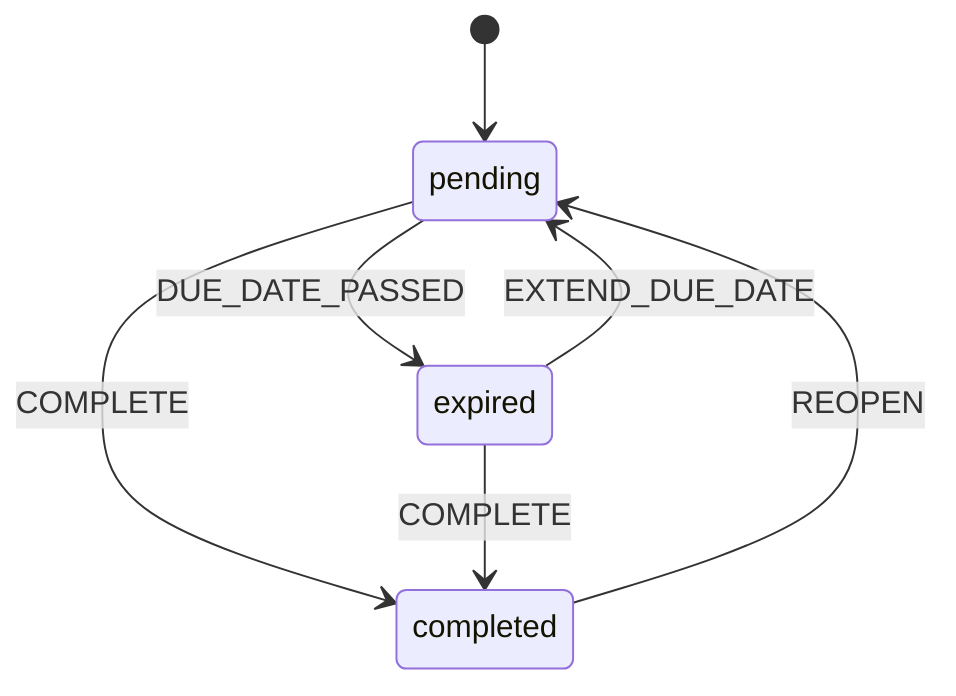
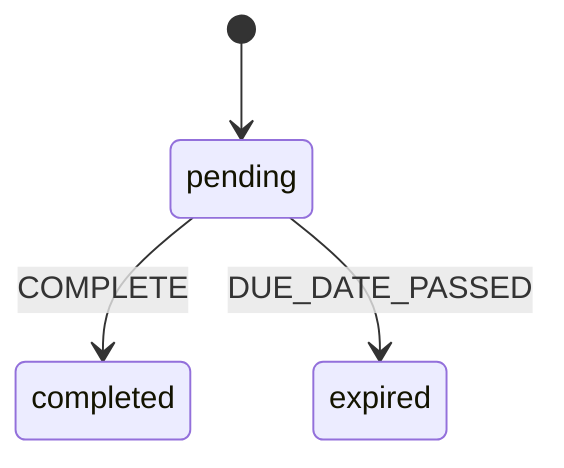

# L0-4: 状態遷移対話プロトコル

XState v5 + Mermaid による状態機械定義と可視化のための対話プロトコル。
完全モードでは `spec/state-machine.ts` + `spec/state-diagrams.md`、簡易モードでは `spec/state-diagrams.md` のみを生成する。

---

## 原則

- 状態は明示的に列挙する（「進行中」「完了」等の言葉で）
- 遷移イベントは **大文字スネークケース**（`COMPLETE` / `DUE_DATE_PASSED`）
- 不可能な遷移は**書かない**（書かれていない = 禁止）
- 時間経過・外部イベントによる自動遷移は明示的にマークする（Sad Path 候補）
- 画面遷移と業務エンティティ状態は**別の状態機械**として分離する
- 共通プロトコルは `subphase-common-protocol.md` を参照

---

## 起動条件

`subphase-selection.md` の起動判定表より:

| 条件 | モード |
|---|---|
| 画面遷移が複雑（3 画面以上 or 分岐あり）、または業務状態のライフサイクル定義が必要 | 完全モード（XState + Mermaid） |
| 画面数少 かつ 業務状態はフラグのみ、だが可視化はしたい | 簡易モード（Mermaid のみ） |
| 状態概念が存在しない（ステートレス CLI 等） | スキップ |

---

## モード定義

### 完全モード
- XState v5 の JSON オブジェクトで状態機械定義
- 複数の並列状態機械を許容（例: アプリ遷移 + エンティティライフサイクル）
- Mermaid `stateDiagram-v2` で図示併載

### 簡易モード
- Mermaid のみ（XState を省略）
- 可視化が目的、ランタイム検証はしない

### スキップ
- 状態遷移ファイル群を生成しない
- L0-6 の状態遷移 Feature は書かない

---

## 対話カテゴリ

各カテゴリで 1〜3 問を投げる。共通プロトコルの「1 回のターンで 5 問を超えない」原則を守る。

### Cat-1: 状態機械の粒度

- 状態を持つ対象は何ですか？（画面 / エンティティ / ワークフロー）
- 1 つの状態機械で表現しますか？ 複数に分けますか？

### Cat-2: 状態の列挙

- 取りうる状態をすべて挙げてください（2〜10 個程度）
- 初期状態は？ 終了状態は？（存在する場合）

### Cat-3: 遷移イベント

- 状態から状態への遷移のきっかけは？（ユーザー操作 / 時間経過 / 外部通知）
- 同じイベントで複数の状態に遷移する分岐条件はありますか？

### Cat-4: 禁止遷移

- やってはいけない遷移は？（例: 完了 → 削除済み への直接遷移禁止）
- ロールバック（戻る）遷移は許可されていますか？

### Cat-5: 自動遷移・タイマー

- 時間経過で自動的に変わる状態はありますか？（期限切れ / タイムアウト）
- 外部イベントで強制遷移するものはありますか？（セッション失効等）

---

## 生成物フォーマット

### ファイル配置
完全モード: `spec/state-machine.ts` + `spec/state-diagrams.md`
簡易モード: `spec/state-diagrams.md` のみ

### 冒頭コメント規約

```typescript
// L0-4: State Machine (XState v5 JSON)
// モード: 完全 | 簡易
// 生成日: YYYY-MM-DD
// 依存: spec/domain.ts の enum 値（状態名）を継承
```

### 主要セクション構造（完全モード）

```
state-machine.ts:
1. export const <name>Machine = { id, initial, states, ... }（複数可）

state-diagrams.md:
1. 画面遷移図（Mermaid stateDiagram-v2）
2. エンティティ状態遷移図（Mermaid stateDiagram-v2）
```

---

## TodoApp 実例（完全モード）

### `spec/state-machine.ts`

```typescript
// L0-4: State Machine (XState v5 JSON)

// ===== 画面遷移（アプリ全体）=====
export const appMachine = {
  id: "app",
  initial: "loggedOut",
  states: {
    loggedOut: {
      on: {
        LOGIN_SUCCESS: "loggedIn",
      },
    },
    loggedIn: {
      initial: "todoList",
      states: {
        todoList: {
          on: {
            CREATE_TODO: "todoCreate",
            SELECT_TODO: "todoDetail",
          },
        },
        todoCreate: {
          on: {
            SAVE_SUCCESS: "todoList",
            CANCEL: "todoList",
          },
        },
        todoDetail: {
          on: {
            EDIT: "todoEdit",
            DELETE_SUCCESS: "todoList",
            BACK: "todoList",
          },
        },
        todoEdit: {
          on: {
            SAVE_SUCCESS: "todoDetail",
            CANCEL: "todoDetail",
          },
        },
      },
      on: {
        LOGOUT: "loggedOut",
        SESSION_EXPIRED: "loggedOut",  // Sad Path
      },
    },
  },
};

// ===== TODOステータスのライフサイクル =====
export const todoStatusMachine = {
  id: "todoStatus",
  initial: "pending",
  states: {
    pending: {
      on: {
        COMPLETE: "completed",
        DUE_DATE_PASSED: "expired",  // 自動遷移（SPEC優先順位2）
      },
    },
    completed: {
      on: {
        REOPEN: "pending",
      },
    },
    expired: {
      on: {
        COMPLETE: "completed",   // 期限切れでも完了可能
        EXTEND_DUE_DATE: "pending",  // 締切延長で復帰
      },
    },
  },
};
```

### `spec/state-diagrams.md`

````markdown
# 状態遷移図（Mermaid版）

## アプリ画面遷移



## TODOステータス


````

---

## 簡易モード成果物例

`spec/state-diagrams.md` のみ:

````markdown
# 状態遷移図（簡易モード）

## TODOステータス


````

XState JSON を省略。可視化のみ。

---

## 前サブフェーズからの入力

- **L0-1 `SPEC.md`**: WHAT 節の画面一覧、条件節の自動遷移条件（例: 「締切を過ぎたら期限切れ」）
- **L0-2 `domain.ts`**: `TodoStatus` などの enum 値を状態名として再利用（翻訳しない）

---

## 後続サブフェーズへの出力

以下の要素が後続で参照される（`subphase-common-protocol.md` の I/O 契約表と整合）:

- **状態名**: `pending` / `completed` / `expired` → L0-6 の Given 節
- **遷移イベント**: `COMPLETE` / `DUE_DATE_PASSED` → L0-6 の When 節
- **初期状態**: L0-6 の Feature 冒頭 Background
- **Sad Path トリガー**: `SESSION_EXPIRED` → L0-6 の Sad Path Scenario

---

## 検証フェーズ（Phase γ）

生成後、以下をクロスチェック:

| 観点 | チェック方法 |
|---|---|
| domain.ts の enum と一致 | `TodoStatus` の値が `todoStatusMachine.states` のキーと完全一致 |
| XState JSON ↔ Mermaid 整合 | 両者の状態・遷移が同一集合（片方漏れなし） |
| 初期状態の妥当性 | SPEC.md の「新規作成時の状態」と一致 |
| 禁止遷移の未記述確認 | Cat-4 で禁止と明示された遷移が JSON / 図に存在しない |
| 自動遷移のマーク | 時間・外部起因の遷移に `// 自動遷移` コメント |

不整合検出時は Phase α に戻り、該当 Cat の追加質問を投げる。

---

## 検証コマンド

Phase 2 で `sensors/computational.md` に正式移動予定。Phase 1 では以下を推奨として記録のみ:

```bash
# XState validator（ランタイム検証）
node -e "const {todoStatusMachine} = require('./spec/state-machine.ts'); const {createMachine} = require('xstate'); createMachine(todoStatusMachine);"

# Mermaid 構文チェック
npx @mermaid-js/mermaid-cli -i spec/state-diagrams.md -o /tmp/out.svg
```

---

## 既存の類似単層ファイルとの関係

- `arc-patterns/event-sourcing.md`: イベントソーシング系では状態機械そのものがイベントストリームのリプレイ定義となる。L0-4 完全モードが前提条件
- `schema-evolution.md`: 状態の追加・廃止は破壊的変更扱いとなる可能性。L0-4 改訂時は互換性ポリシーを参照

---

## L1 との連携

L1 autonomous-dev は `spec/state-machine.ts` を以下のように利用する:

- `createMachine(appMachine)` で XState ランタイムを構築
- 状態ガードは L0-5 の認可ルールと組み合わせて `guard` フィールドに展開
- テストでは状態機械の到達可能性チェックを自動生成

---

## プロトコル自己評価

- XState v5 JSON は型の厳密性がやや弱い（`states` のキーが文字列）。型安全を優先する場合は `setup()` API への移行を Phase 2 以降で検討
- Mermaid との二重管理は冗長だが、人間レビューでは図の方が確実に読まれる。両方必須
- 複雑な階層状態（parallel states / history states）は非エンジニアに伝わりにくい。初回は flat で定義し、必要になったら階層化
