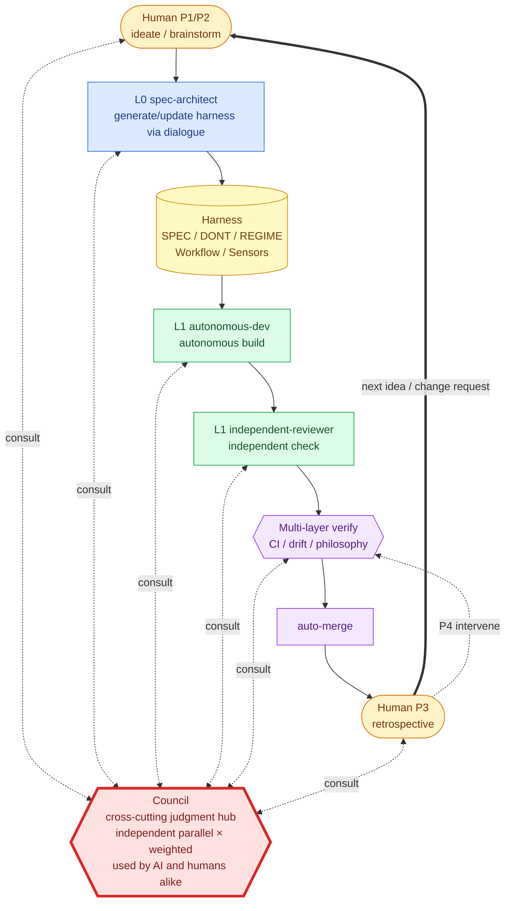

<div align="right">

[日本語](./README.md) ｜ **English**

</div>

# dialog-harness

> **Generate harnesses from dialogue.**
>
> Don't have AI write the code — have it build the entire "space" where AI can develop autonomously, through dialogue alone.

`dialog-harness` (DH) is a **meta-harness** that runs on top of Claude Code — a "harness that generates harnesses."
From a human's "I want to build something like this," DH produces the **specs, constraints, workflows, sensors, and constitution** needed for AI-autonomous development.

---

## What is DH?

A **two-stage structure: "dialogue → harness → development"** is the whole thing.

```
┌──────────┐ dialogue ┌──────────┐ generate ┌────────────────┐  drive   ┌────────────────┐
│  Human   │ ───────▶ │   L0     │ ───────▶ │   Harness      │ ───────▶ │ AI-autonomous  │
│ (idea)   │ ◀─────── │ spec-    │          │ SPEC / DONT    │          │ development    │
└──────────┘ dialogue │ architect│          │ REGIME         │          │ L1 implement   │
                     └──────────┘          │ Workflow       │          │ Council judge  │
                                           │ Sensors        │          │ Multi-verify   │
                                           │ Philosophy (8) │          │ auto-merge     │
                                           └────────────────┘          └────────────────┘
```

- **Dialogue stage** — Human and L0 reconcile intent (no hands moving)
- **Harness generation** — Project-specific rules, sensors, workflows are auto-generated
- **AI-autonomous development** — Under the generated harness, AI runs the show

And **the harness is not a fixed asset.** When a new feature or spec change arises, the human dialogues with L0 again — and the harness evolves (the L0 loop).

---

## Industry map — similar, but different

| Category | Examples | What it generates |
|---|---|---|
| Code Completion | GitHub Copilot, Tabnine | Code fragments |
| AI IDE | Cursor, Windsurf | Chat + code edits |
| Agent CLI | **Claude Code**, Aider, Codex CLI | Structured code changes |
| App Generation | Bolt.new, v0, Lovable | Running apps (one-shot) |
| Spec-Driven Dev | Kiro, GitHub Spec-Kit, CoDD | Spec → code |
| Agent Framework | AutoGen, CrewAI, LangGraph | Agent execution |
| **Meta-Harness** | **dialog-harness** | **The "environment" for AI-autonomous dev itself** |

DH **does not replace** the layers above. It sits on top of Claude Code, **composing project-specific harnesses through dialogue.**

```
┌──────────────────────────────────┐
│  Meta-Harness  ←  dialog-harness  │ dialogue → harness generation
├──────────────────────────────────┤
│  Agent CLI    ←  Claude Code     │ DH's execution substrate
├──────────────────────────────────┤
│  LLM API      ←  Anthropic       │
└──────────────────────────────────┘
```

### What's different

| Axis | Typical AI dev tools | DH |
|---|---|---|
| **Starting point** | Prompt / code / spec | **Dialogue** (images, nuance) |
| **Output** | Code / apps / agents | **Harness** (rules, sensors, workflows, constitution) |
| **Evolution** | Per-session, or developer-driven | **L0 loop** — harness grows with each new idea |
| **Target user** | Engineers | **Non-engineers, by design** (no hands moving) |

---

## How it works — dialogue → harness → implementation → next dialogue



### How to read this diagram

- **Council = central judgment hub** — invokable from every point that needs a judgment. Not only AI nodes (L0 / L1 / independent-review / multi-layer verify), but **humans themselves can consult Council too**. "I'm stuck deciding the design," "I'm unsure if this direction is right" — **Council offloads the human's cognitive load as well**
- **Thick solid line (`==>`) = L0 loop** — the retrospective feeds back into ideation; the harness grows as an accumulation of dialogue
- **Thin solid lines = development pipeline** — dialogue → harness → build → verify → merge
- **Dashed lines (bidirectional) = Council consultation** — consult → weighted judgment → result returned (only escalates to a human when truly split)
- **Stop / intervene (P4)** — humans cut into the VERIFY layer when needed

> **The cycle revolves around Council.** Neither AI nor humans need to stall at decision points. Council shoulders the call; humans only sign off at the end.

### The L0 loop — DH's core

The thick line (`==>`) is the **L0 loop**:

- **1st dialogue** — Project kickoff. Initial harness generated.
- **2nd dialogue** — New feature idea. Harness extended.
- **Nth dialogue** — Spec change, refactor request. Harness keeps growing.

The harness isn't "done and shipped" — it's **a living accumulation of dialogue, growing with the project.**

Humans touch only four points — **Ideation (P1) / Brainstorming (P2) / Retrospective (P3) / Emergency intervention (P4)**. Everything else is AI's hands.

---

## Usage (4 steps)

### 1. Install

```bash
# from your project root
mkdir -p .claude
cp -r dialog-harness/.claude/skills .claude/
cp dialog-harness/.claude/hooks.json .claude/
cp -r dialog-harness/templates ./       # needed by autonomous-drive (autonomous mode)
```

### 2. Generate the harness via dialogue (L0, first time)

Just talk to Claude Code — `layer0-spec-architect` activates.

```
> I want to build a meal-plan memo app for my wife. I only have a vague image.
```

L0 dialogues with you and generates SPEC.md / DONT.md / REGIME.md / workflow templates.

### 3. Hand the build off (L1)

Once the spec is set:

```
> implement it
```

`layer1-autonomous-dev` builds autonomously, `layer1-independent-reviewer` verifies, and a `HANDOFF.md` is tributed.

### 4. Extend the harness with the next dialogue (L0 loop)

New features or change requests go back to L0:

```
> Add Google Drive sync to the save feature
```

L0 updates the harness, and L1 starts the extended implementation. The harness keeps growing through this loop.

---

## Council — offloading judgment to reduce cognitive load

A consensus mechanism that offloads "A vs B" / "is this safe to merge?" decisions — usable by **both AI nodes and humans themselves**.
**Three personas (Businessperson, Engineer, Philosopher) produce opinions independently and in parallel; the system aggregates them by weight.** No deliberation — that's deliberate (to avoid AI context-noise and herd bias).

| Caller | When to consult |
|---|---|
| **AI nodes** | L0 design choices, L1 implementation trade-offs, independent-review boundary calls, multi-layer verify thresholds |
| **Humans** | "I can't decide the design," "Not sure if this direction is right," "Three plans look equally good" — any moment when you want to offload the cognitive load of judgment |

### The aggregation formula

```
weighted_score(stance) = Σ (each persona's weight × confidence)
The stance with the highest score becomes the recommendation.
If judgment_confidence is above threshold → auto_agree.
```

### Example: opinions split (`wfbase1`)

Real judgment on the autonomous-drive WF base design (Plan H: Hybrid / Plan N: single fractal shape):

| Persona | weight | × | confidence | = | score | vote |
|---|---:|---|---:|---|---:|---|
| Businessperson | 3 | × | 0.70 | = | 2.10 | **Plan H** |
| Engineer       | 3 | × | 0.85 | = | 2.55 | **Plan H** |
| Philosopher    | **5** | × | 0.65 | = | 3.25 | **Plan N** |

**Per-stance aggregation:**

| stance | supporters | weighted_score |
|---|---|---:|
| **Plan H** | Businessperson + Engineer | **4.65** ← winner |
| Plan N | Philosopher (solo) | 3.25 |

The Philosopher has the highest weight (5), but Businessperson + Engineer combined (4.65) wins, so **Plan H is adopted as the core**.
But the **Philosopher's minority view ("keep WF shape singular") is incorporated as an operating principle** — function-type overrides are allowed only when observation demands it. The minority view is preserved in `minority_opinion` and always reflected in the final outcome (a core behavior of Council).
`judgment_confidence: 0.75` → `auto_agree` → **human only reads the result**.

When opinions truly split and `judgment_confidence` falls below threshold, `escalate_to_human` returns the call to a human.
All judgments are appended to [`history/COUNCIL-LOG.md`](history/COUNCIL-LOG.md).

> Let Council handle the everyday calls; humans show up only when it truly splits.

---

## Environment setup (what humans do by hand)

Setup that AI cannot do for you, for security reasons. **If you get stuck, ask Claude Code directly — it walks you through.**

| Item | Why AI can't do it |
|---|---|
| Install Claude Code | Needs OS exec permission + browser auth |
| Create GitHub account / repo | Auth is personal |
| Issue Personal Access Tokens | Secret-key generation is human-only |
| Set Repository Secrets | Settings editing needs admin rights |
| Create Labels | (for autonomous-drive) |

### Secrets for `autonomous` mode (all required)

- `CLAUDE_CODE_OAUTH_TOKEN` — Run Claude Code from GitHub Actions (issue via `claude setup-token`)
- `GH_REVIEW_PAT` — Used by auto-merge / gemini-review / **issue-pickup commit & push**.
  **Required permissions: Contents = Read+Write / Pull requests = Read+Write / Issues = Read+Write / Metadata = Read**
- `GEMINI_API_KEY` — gemini-review + **issue-pickup AI triage** (autonomous startup is skipped if missing)

### Labels for autonomous-drive

- `ready-for-ai` / `do-not-merge` / `human-review-needed` / `pickup-failed`

---

## Call for collaborators

DH is an experimental project that **seriously chases the goal of "development where humans don't move their hands."**

- **Push the boundary of dialogue-driven meta-frameworks with us**
- **Help evolve the 8-article constitution and the Council mechanism**
- **Deploy DH in your own project and feed retrospectives back upstream**

### How to join in

1. Open an Issue / Discussion with "I tried it", "this got stuck", or "I'd change this"
2. Write a retrospective using `templates/rituals/wave-end-retrospective.template.md` and send a PR
3. If you disagree with a Council judgment in `history/COUNCIL-LOG.md`, raise a minority opinion

> Humans do what AI cannot. AI does what humans don't need to.
> That's why **humans ≒ Council** — symmetric as judgment organs.

---

## References

- Philosophy source: [`.claude/skills/layer0-spec-architect/references/philosophy.md`](.claude/skills/layer0-spec-architect/references/philosophy.md)
- Changelog: [`history/CHANGELOG.md`](history/CHANGELOG.md)
- Design intent: [`history/INTENT.md`](history/INTENT.md)
- Observed peers: [`.claude/skills/layer0-spec-architect/references/observed-peers.md`](.claude/skills/layer0-spec-architect/references/observed-peers.md)
