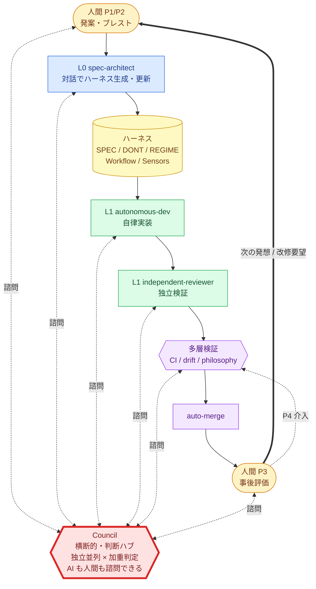

<div align="right">

**日本語** ｜ [English](./README.en.md)

</div>

# dialog-harness

> **対話からハーネスを生み出す。**
>
> AI に開発させるのではなく、AI が自律開発するための「場」ごと対話で作る。

`dialog-harness`（DH）は、Claude Code 上で動く **メタハーネス** — 「ハーネスを生み出すハーネス」です。
人間の「こういうの作りたい」という対話から、AI 自律駆動開発に必要な **仕様書・制約・ワークフロー・センサー・憲法** を丸ごと生成します。

---

## DH とはなにか？

**「対話 → ハーネス → 開発」の 2 段階構造** がすべて。

```
┌──────────┐   対話   ┌──────────┐   生成   ┌────────────────┐   駆動   ┌────────────────┐
│  人間     │ ───────▶│   L0     │ ───────▶│   ハーネス       │ ───────▶│  AI 自律開発     │
│ (イメージ) │ ◀───── │spec-     │          │ SPEC / DONT     │          │ L1 実装         │
└──────────┘  対話   │architect │          │ REGIME          │          │ Council 判断     │
                    └──────────┘          │ Workflow        │          │ 多層検証         │
                                          │ Sensors         │          │ auto-merge      │
                                          │ philosophy (8条) │          └────────────────┘
                                          └────────────────┘
```

- **対話段階**：人間と L0 が意図を擦り合わせる（手を動かさない）
- **ハーネス生成**：プロジェクト固有の規律・センサー・WF が自動生成される
- **AI 自律開発**：生成されたハーネスのもとで AI が走る

そして **ハーネスは固定資産ではない**。新機能発想・仕様変更があれば、人間は再び L0 と対話し、ハーネスが進化する（L0 ループ）。

---

## 業界マップ — 似ているが、違うもの

| カテゴリ | 代表例 | 何を生成するか |
|---|---|---|
| Code Completion | GitHub Copilot, Tabnine | コード片（行・関数） |
| AI IDE | Cursor, Windsurf | 対話 + コード編集 |
| Agent CLI | **Claude Code**, Aider, Codex CLI | 構造化されたコード変更 |
| App Generation | Bolt.new, v0, Lovable | 動くアプリ（one-shot） |
| Spec-Driven Dev | Kiro, GitHub Spec-Kit, CoDD | 仕様 → コード |
| Agent Framework | AutoGen, CrewAI, LangGraph | エージェント実行 |
| **Meta-Harness** | **dialog-harness** | **AI 自律開発の「環境」自体** |

DH は上の層を**置き換えない**。Claude Code を基盤に、その上で **プロジェクト固有のハーネスを対話で編成する** 層です。

```
┌──────────────────────────────────┐
│  Meta-Harness  ←  dialog-harness  │ 対話 → ハーネス生成
├──────────────────────────────────┤
│  Agent CLI    ←  Claude Code     │ DH の実行基盤
├──────────────────────────────────┤
│  LLM API      ←  Anthropic       │
└──────────────────────────────────┘
```

### 何が違うのか

| 軸 | 一般的な AI 開発ツール | DH |
|---|---|---|
| **起点** | プロンプト / コード / 仕様 | **対話**（イメージ・ニュアンス） |
| **出力** | コード / アプリ / エージェント | **ハーネス**（規律・センサー・WF・憲法） |
| **進化** | セッション内 or 開発者改修 | **L0 ループ** — 新発想ごとにハーネスが育つ |
| **対象** | エンジニア | **非エンジニア前提**（手を動かさない） |

---

## どう機能するか — 対話 → ハーネス → 実装 → 次の対話



### 図の読み方

- **Council = 中央の判断ハブ** — 判断が必要な全地点から諮問できる横断機構。AI ノード（L0 / L1 / 独立検証 / 多層検証）だけでなく **人間自身も Council に諮問できる**。「どう設計するか迷う」「この方針で良いか不安」といった **人間側の認知負荷も Council が肩代わりする**
- **太い実線（`==>`）= L0 ループ** — 事後評価から次の発案に戻り、ハーネスが対話の蓄積として育つ
- **細い実線 = 開発パイプライン** — 対話 → ハーネス → 実装 → 検証 → merge
- **破線（双方向）= Council 諮問** — 諮問 → 加重判定 → 結果返却（拮抗時のみ `escalate_to_human`）
- **停止介入（P4）** — 暴走時に人間が VERIFY 層に割り込む

> **サイクルは Council を中心に回る**。AI も人間も、判断点で立ち止まる必要はない。Council が肩代わりし、最終承認だけ人間が出す。

### L0 ループ — DH の核心

太い実線（`==>`）が **L0 ループ**：

- **1 回目の対話** — プロジェクト立ち上げ。初期ハーネスを生成
- **2 回目の対話** — 新機能発案。ハーネスを拡張
- **N 回目の対話** — 仕様変更・改修要望。ハーネスが育つ

ハーネスは「完成して終わり」ではなく、**プロジェクトとともに進化する対話の蓄積** です。

人間が触るのは **発案（P1）／ブレスト（P2）／事後確認（P3）／暴走介入（P4）** の 4 点のみ。それ以外は AI が担います。

---

## 使い方（4 ステップ）

### 1. 取り込み

```bash
# 自プロジェクトのルートで
mkdir -p .claude
cp -r dialog-harness/.claude/skills .claude/
cp dialog-harness/.claude/hooks.json .claude/
cp -r dialog-harness/templates ./       # autonomous モード用（autonomous-drive が参照）
```

### 2. 対話でハーネスを生む（L0、初回）

Claude Code に話しかけるだけで `layer0-spec-architect` が起動。

```
> 妻のための献立メモアプリを作りたい。まだイメージしかない。
```

L0 が対話を重ね、SPEC.md / DONT.md / REGIME.md / Workflow テンプレを生成します。

### 3. 実装を任せる（L1）

仕様が固まったら：

```
> 実装して
```

`layer1-autonomous-dev` が自律実装し、`layer1-independent-reviewer` が独立検証して `HANDOFF.md` を献上します。

### 4. 次の対話でハーネスを拡張する（L0 ループ）

新機能や改修要望は再び L0 に投げる：

```
> 保存機能、Google Drive 同期に対応させたい
```

L0 がハーネスを更新し、L1 が拡張実装に入ります。ハーネスはこのループで育ち続けます。

---

## Council — 判断の肩代わりで認知負荷を下げる

開発中の「A vs B」「これ本当に入れていい？」を **AI に肩代わりさせる合議機構** — そして **人間自身も使える判断ハブ**。
**3 ペルソナ（経営者・開発者・哲学者）が独立並列で意見を出し、加重で判定**。議論はしません（AI の context ノイズ・追従バイアス回避）。

| 利用者 | 諮問する場面 |
|---|---|
| **AI ノード** | L0 の設計判断、L1 の実装トレードオフ、独立検証の境界判断、多層検証の閾値判定 |
| **人間** | 「どう設計すべきか迷う」「この方針で良いか不安」「3 案のどれを採るか決められない」など、自分の判断負荷を下げたい場面 |

### 加重判定の式

```
weighted_score(stance) = Σ (各ペルソナの weight × confidence)
最大値の stance が recommended → confidence 閾値超なら auto_agree
```

### 例：意見が割れた（`wfbase1`）

自律駆動 WF の基底設計（案 H: Hybrid / 案 N: 形状単一化）：

| ペルソナ | weight | × | confidence | = | score | 投票 |
|---|---:|---|---:|---|---:|---|
| 経営者 | 3 | × | 0.70 | = | 2.10 | **案 H** |
| 開発者 | 3 | × | 0.85 | = | 2.55 | **案 H** |
| 哲学者 | **5** | × | 0.65 | = | 3.25 | **案 N** |

**stance 集計：**

| stance | 支持者 | weighted_score |
|---|---|---:|
| **案 H** | 経営者 + 開発者 | **4.65** ← 勝ち |
| 案 N | 哲学者 | 3.25 |

哲学者の weight が最大（5）でも、経営者 + 開発者の合計（4.65）が上回り **案 H を中核採用**。
ただし **哲学者の少数意見「WF 形状単一性」を運用原則として組み込む**（機能タイプ別 override は観測駆動で最小限に限定）。少数意見は `minority_opinion` に保存され、Council の核心動作として常に反映される。
`judgment_confidence: 0.75` → `auto_agree` → **人間は結果を確認するだけ**。

判定が拮抗して `judgment_confidence` が閾値を下回ると `escalate_to_human` で人間に戻ります。
全判定は [`history/COUNCIL-LOG.md`](history/COUNCIL-LOG.md) に append-only で蓄積。

> 普段は Council に任せ、本当に割れた時だけ人間が出る。

---

## 環境設定（人間がやる範囲）

セキュリティ上 AI が代行できない設定は人間の担当。**詰まったら Claude Code に直接聞けば対話で案内します。**

| 項目 | なぜ AI がやれないか |
|---|---|
| Claude Code インストール | OS 実行権限・ブラウザ認証 |
| GitHub アカウント / Repo 作成 | 認証が個人に紐づく |
| Personal Access Token 発行 | 秘密鍵の生成権限は人間専属 |
| Repository Secrets 設定 | Settings 編集に admin 権限が必須 |
| ラベル作成 | (autonomous-drive 用) |

### `autonomous` モードで必要な Secrets（すべて必須）

- `CLAUDE_CODE_OAUTH_TOKEN` — GitHub Actions 上で Claude Code を起動（`claude setup-token` で発行）
- `GH_REVIEW_PAT` — auto-merge / gemini-review / **issue-pickup の commit/push** で使用。
  **必要権限：Contents = Read+Write / Pull requests = Read+Write / Issues = Read+Write / Metadata = Read**
- `GEMINI_API_KEY` — gemini-review + **issue-pickup の AI triage**（未設定だと autonomous 起動が skip される）

### autonomous-drive 用ラベル

- `ready-for-ai` / `do-not-merge` / `human-review-needed` / `pickup-failed`

---

## 協力者募集

DH は **「人間が手を動かさずに済む開発」を本気で追求する** 実験プロジェクトです。

- **対話駆動メタフレームワークの境界線を一緒に押し広げたい人**
- **8 条憲法 × Council 機構の進化に貢献したい人**
- **自プロジェクトに DH を導入し、振り返りを還流してくれる人**

### 入り方

1. Issue / Discussion に「触ってみた」「ここが詰まった」「こう変えたい」を投げる
2. `templates/rituals/wave-end-retrospective.template.md` で振り返りを書いて PR を出す
3. Council 諮問（`history/COUNCIL-LOG.md`）の判定に異論があれば、minority opinion を立てる

> AI ができないことを人間がする。人間がしなくていいことを AI がする。
> だから **人間 ≒ Council** — 判断機構として対称になる。

---

## 参照

- 哲学原典：[`.claude/skills/layer0-spec-architect/references/philosophy.md`](.claude/skills/layer0-spec-architect/references/philosophy.md)
- 改修履歴：[`history/CHANGELOG.md`](history/CHANGELOG.md)
- 設計意図：[`history/INTENT.md`](history/INTENT.md)
- 業界観察：[`.claude/skills/layer0-spec-architect/references/observed-peers.md`](.claude/skills/layer0-spec-architect/references/observed-peers.md)
