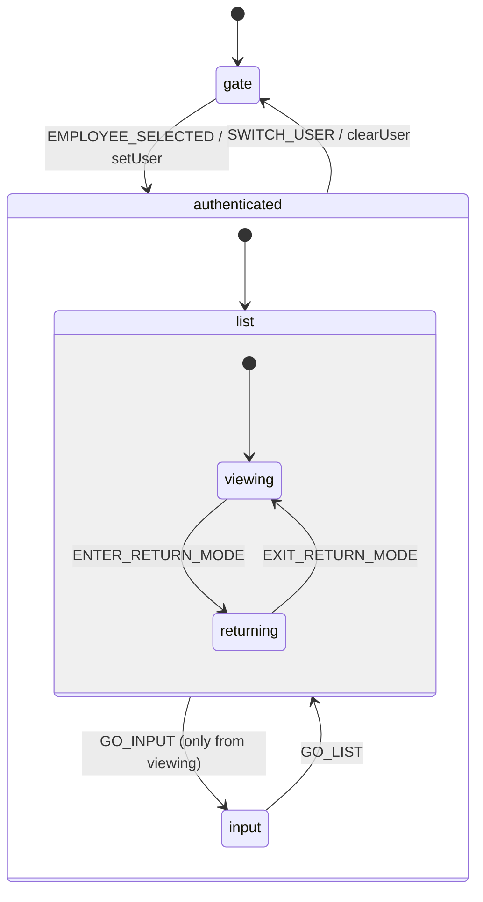
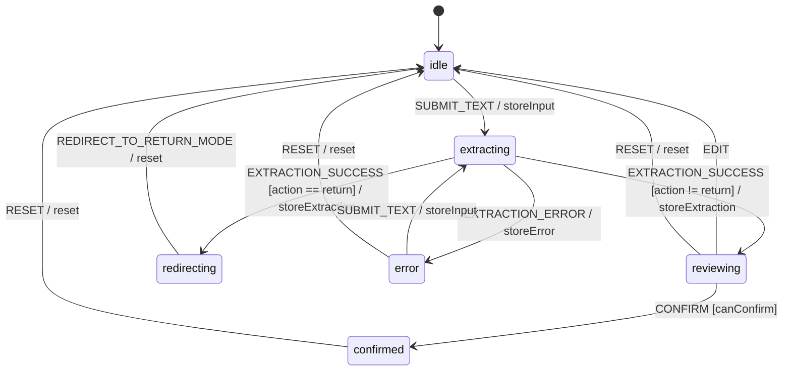

# L0-4 状態遷移図（Mermaid）

XState v5 定義は `spec/state-machine.ts` 参照。本書はその可視化と説明。

---

## 1. AppMachine — アプリ全体の画面遷移



### 状態の意味

| 状態 | 説明 |
|---|---|
| `gate` | 社員選択画面（F1 ユーザー識別）。未認証 |
| `authenticated.input` | CaaF入力タブ（F2/F5） |
| `authenticated.list.viewing` | 一覧タブ・閲覧モード（F3/F7）。カードタップ無効 |
| `authenticated.list.returning` | 一覧タブ・返却モード（F4）。チェックボックスでの複数選択 |

### 遷移イベント

- `EMPLOYEE_SELECTED` — ゲートで社員選択
- `GO_INPUT` / `GO_LIST` — タブ切替（タブクリック）
- `ENTER_RETURN_MODE` / `EXIT_RETURN_MODE` — 一覧内モード切替
- `SWITCH_USER` — ヘッダー「切替」ボタンでゲートへ戻る

### 設計意図

- 返却モードは一覧の子状態。誤返却防止のため**閲覧と返却を物理的にモード分離**（方式B、SPEC F4 参照）
- `SWITCH_USER` は authenticated のどこからでも発火可能（複数人で端末共有想定）

---

## 2. CaaFCardMachine — 確認カードのライフサイクル



### 状態の意味

| 状態 | 説明 |
|---|---|
| `idle` | 自然文未入力 or 入力前 |
| `extracting` | LLM ルーター呼出中（タイムアウト 5000ms） |
| `reviewing` | 抽出結果を信号色付き確認カードで表示中。人間タップ待ち |
| `redirecting` | LLM が `action="return"` を抽出 → 一覧返却モードへ誘導フェーズ |
| `error` | パース失敗 / タイムアウト |
| `confirmed` | INSERT 完了。次の入力に備え `RESET` で `idle` へ |

### ガード（`canConfirm`）

- `extraction !== null`
- `extraction.items.length > 0`
- `signal !== "red"`
- `extraction.action !== "return"`

これは **「Phase 0 全件確認」「曖昧な返却を LLM 推論で展開しない」（D-5）** を機械的に担保する不変条件。

### 信号色の決定（status マシン外、純粋関数）

```
signal = computeSignal(extraction)
  if items.length == 0          → "red"
  if anyItem.confidence < 0.6   → "orange"
  if anyMasterMismatch          → "orange"
  if minConfidence >= 0.8       → "green"
  if minConfidence >= 0.6       → "yellow"
  else                          → "orange"
```

実装は `src/lib/llm/signal.ts`（モックは `caaftoolmockv3.jsx` の `signalOf` 関数を参照）。

### 設計意図

- `action=return` を **状態マシン内で別ルート（redirecting）に分岐** することで、CaaF カードからは返却 INSERT を絶対に発火させない（D-5、罠A補助）
- `confirmed` は副作用（INSERT）の責務を持たず、純粋に「人が確定タップした」事実を表現。実 INSERT は外部 effect handler が担う
- `RESET` は失敗・成功問わず `idle` へ戻る共通経路。連続入力に最適化
